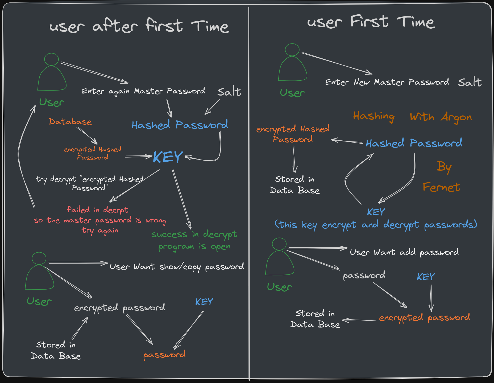
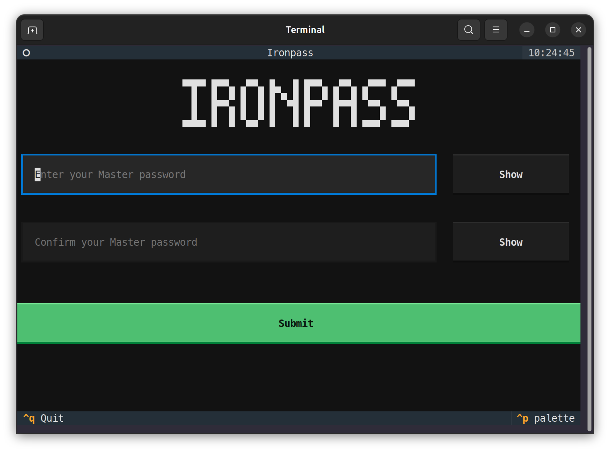
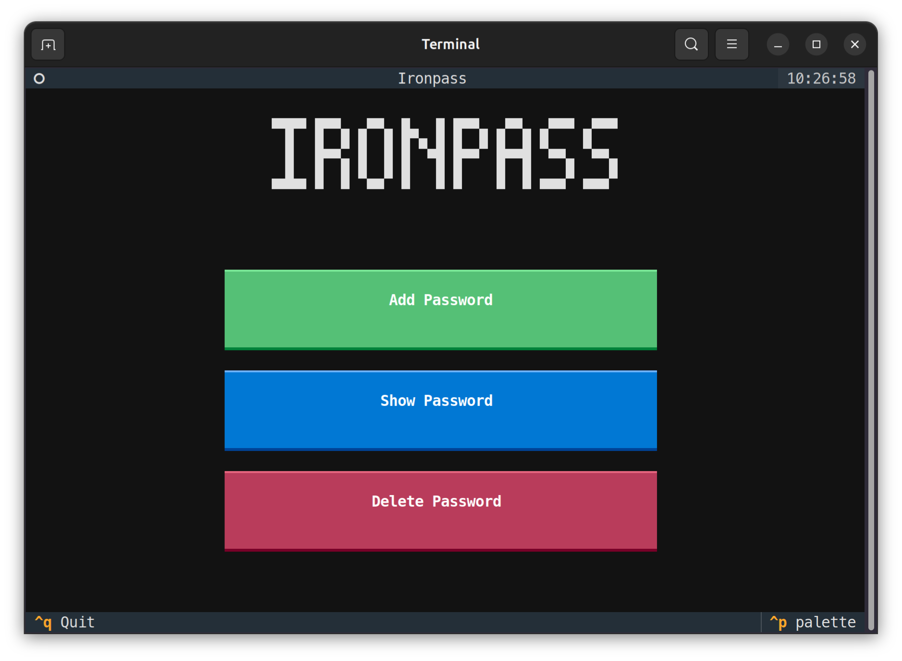
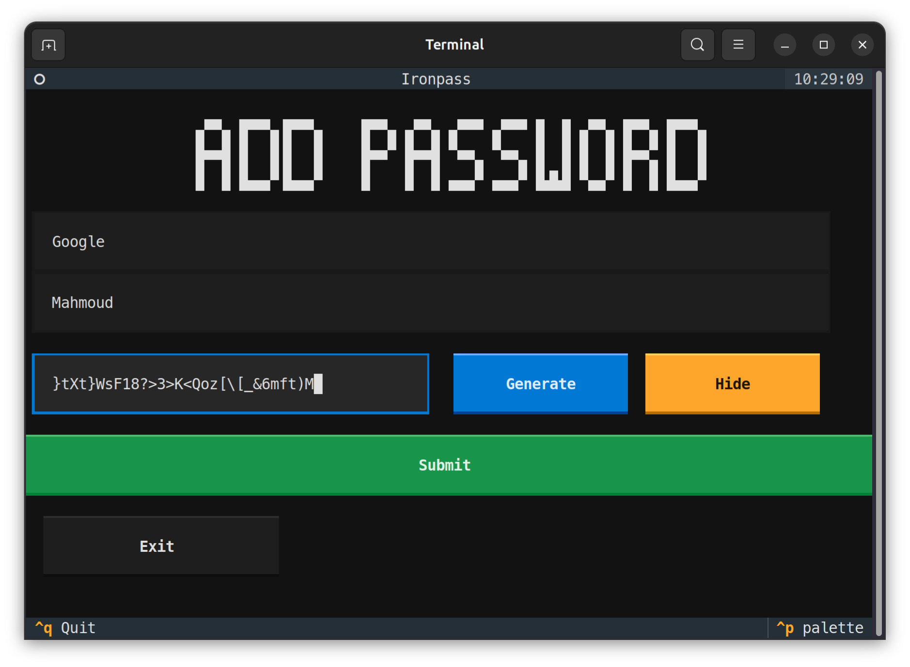
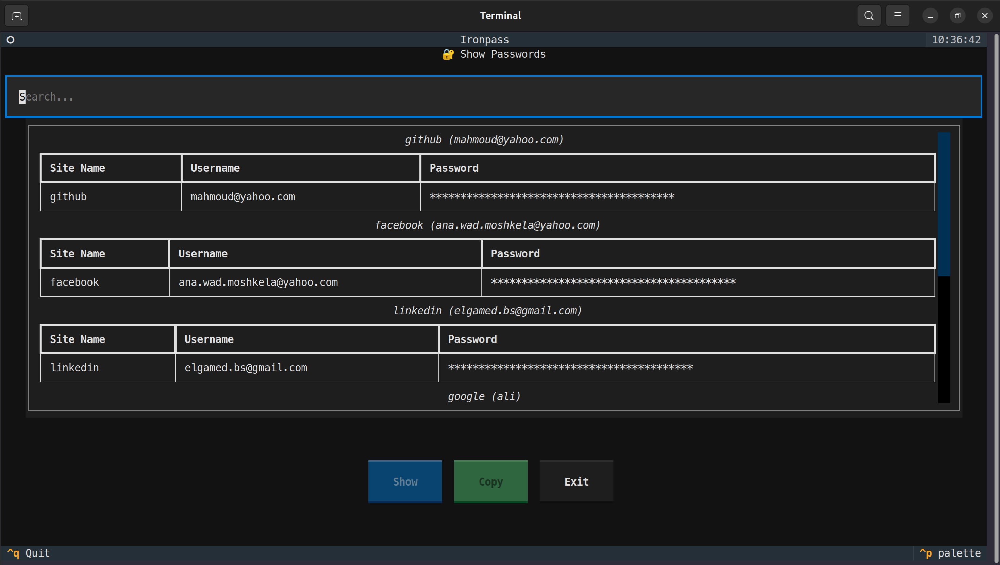
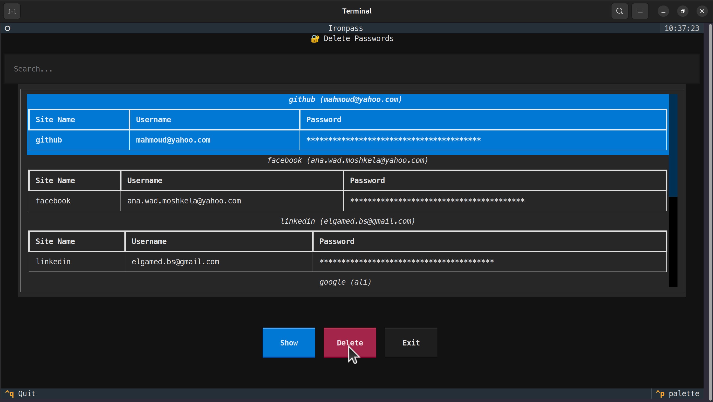
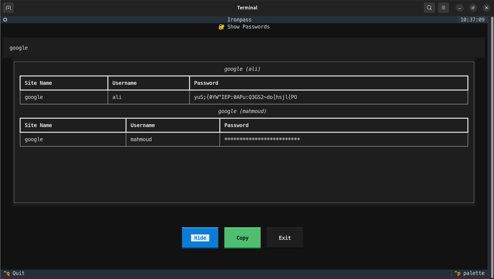

# $$  🔐 IronPass $$ 

<div align="center">


*A secure, cross-platform password management system with elegant Terminal User Interface*

[](https://python.org)
[](LICENSE)
[](https://cryptography.io/)

[Features](#features) • [Installation](#installation) • [Usage](#usage-guide) • [Security](#security-architecture) • [License](#license)

</div>
---

## Table of Contents

- [Overview](#overview)
- [Features](#features)
- [Security Architecture](#security-architecture)
- [Installation](#installation)
- [Usage Guide](#usage-guide)
- [Authentication Logic](#authentication-logic)
- [Technical Implementation](#technical-implementation)
- [Screenshots](#screenshots)
- [Requirements](#requirements)
- [Project Structure](#project-structure)
- [License](#license)
- [Author](#author)

---

## Overview

**IronPass** is a modern, security-first password manager built with Python, featuring a Terminal User Interface (TUI) powered by Textual. It combines military-grade encryption with an intuitive interface designed for terminal environments.

### Key Advantages

- **Zero-Knowledge Architecture**: Master password never leaves your device
- **Modern Terminal Interface**: Rich TUI with mouse and keyboard support  
- **Cryptographically Secure**: Argon2 key derivation with Fernet encryption
- **Local Storage**: Complete data control with no cloud dependencies
- **Cross-Platform**: Works on Windows, macOS, and Linux
- **Multiple Interfaces**: Primary TUI with CLI and GUI alternatives

---

## Features

### 🔒 Security Features
- Master password protection with Argon2 key derivation (128MB memory cost)
- AES-256 encryption via Fernet symmetric encryption
- Cryptographic password generation using Python's `secrets` module
- Salt-based key derivation prevents rainbow table attacks
- Session-based authentication with automatic key clearing

### 🖥️ Terminal User Interface
- Rich terminal interface with colors and interactive elements
- Real-time search and filtering across sites and usernames
- Mouse and keyboard navigation support
- Clipboard integration for secure password copying
- Visual feedback with status messages
- Keyboard shortcuts for efficient operation

### 📊 Password Management
- Secure password generation (20-40 characters with mixed character types)
- Encrypted storage in local SQLite database
- Instant search across all saved passwords
- One-click password copying to clipboard
- Safe deletion with confirmation prompts
- Show/hide passwords on demand

---
## Security Architecture

<!--  -->


### Authentication Logic

IronPass uses a cryptographic approach for authentication that eliminates traditional password comparison:

#### First Time Setup
```
User Password → Salt Generation → Argon2 Derivation → Encryption Key
Authentication Token → Fernet Encryption → Encrypted Storage → Database
```

#### Returning User Authentication
```
User Input → Stored Salt → Argon2 Derivation → Decryption Attempt
Success = Correct Password | Failure = Wrong Password
```

### 🧠 Cryptographic Validation

The authentication mechanism is cryptographically elegant:

1. **Correct Password**: Generates identical encryption key → Decryption succeeds → Access granted
2. **Wrong Password**: Generates different key → Decryption fails → Access denied

No password comparison required - the cryptographic operation validates the password.

### Security Parameters

| Component | Configuration | Purpose |
|-----------|---------------|---------|
| Argon2 | Time: 4, Memory: 128MB, Threads: 4 | Slow key derivation |
| Fernet | AES-256-CBC + HMAC-SHA256 | Symmetric encryption |
| Salt | 256-bit random | Prevent rainbow attacks |
| Key Length | 32 bytes (256-bit) | Encryption strength |

---

## Installation

### Prerequisites
- Python 3.8 or higher
- Terminal with Unicode support for optimal TUI experience

### Quick Installation

```bash
git clone https://github.com/Mahmoud-El-Saeed/IronPass.git
cd IronPass
pip install -r requirements.txt
```

### Manual Dependency Installation

```bash
# Core security libraries
pip install argon2-cffi cryptography

# TUI framework
pip install textual rich

# Utilities
pip install pyperclip

# Optional GUI dependencies
pip install PyQt5
```

### Virtual Environment Setup

```bash
python -m venv ironpass-env

# Windows
ironpass-env\Scripts\activate

# macOS/Linux  
source ironpass-env/bin/activate

pip install -r requirements.txt
```

---

## Usage Guide

### Launch Application

```bash
# Default TUI interface (recommended)
python main.py

# Explicit interface selection
python main.py --tui    # Terminal interface
python main.py --cli    # Command-line interface  
python main.py --gui    # Graphical interface
```

### 🎯 First Time Setup



1. Launch IronPass - automatic first-time detection
2. Create master password meeting requirements:
   - Minimum 9 characters
   - Mixed case letters
   - At least one digit
   - At least one special character
3. Confirm password entry
4. Vault initialization complete
### Daily Operations


### Adding Passwords


1. Select "Add Password" from main menu
2. Enter site identifier (e.g., "github", "gmail")
3. Enter username or email
4. Generate secure password or enter custom password
5. Password encrypted and stored with clipboard copy

### Viewing Passwords  


1. Select "Show Password" from main menu
2. Search/filter by site name or username
3. Select desired entry
4. Toggle password visibility or copy to clipboard

### Deleting Passwords


1. Select "Delete Password" from main menu
2. Search and select entry for removal
3. Confirm deletion
4. Entry permanently removed from storage

### ⌨️ Keyboard Shortcuts

| Key | Action |
|-----|--------|
| Ctrl+Q | Quit application |
| ↑/↓ | Navigate menu items |
| Tab | Move between fields |
| Enter | Confirm selection |
| Esc | Return to previous screen |

---

## Authentication Logic


### Cryptographic Authentication Process

```python
def unlock_app(self, master_password: str) -> bool:
    salt = GetSalt()                                    # Load stored salt
    self.key = GenKey(master_password, salt)           # Derive encryption key
    encrypted_token = GetToken()                       # Retrieve auth token
    try:
        token = Decrypt_Password(encrypted_token, self.key)  # Attempt decryption
        return True                                          # Success
    except:
        return False                                         # Failure
```

### Process Explanation

1. **Salt Retrieval**: Load unique 256-bit salt from storage
2. **Key Derivation**: Generate encryption key using Argon2(password + salt)
3. **Token Decryption**: Attempt to decrypt stored authentication token
4. **Validation**: Success indicates correct password, failure indicates wrong password

This approach provides superior security compared to traditional password hashing:
- No stored password hashes vulnerable to attack
- Timing attack resistance through cryptographic operations
- Authentication doubles as encryption key derivation

---

## Technical Implementation

### Database Schema

```sql
-- Password storage table
CREATE TABLE passwords (
    id INTEGER PRIMARY KEY AUTOINCREMENT,
    site_name TEXT NOT NULL,
    username TEXT NOT NULL,
    encrypted_password TEXT NOT NULL,
    date_created TEXT DEFAULT CURRENT_TIMESTAMP,
    UNIQUE(site_name, username)
);

-- Authentication token storage
CREATE TABLE auth (
    token TEXT NOT NULL
);
```

### Technology Stack

| Technology | Purpose | Details |
|------------|---------|---------|
| Python | Core language | 3.8+ required |
| Textual | TUI framework | Modern terminal interface |
| Argon2 | Key derivation | Password hashing standard |
| Cryptography | Encryption | Fernet symmetric encryption |
| SQLite | Database | Local data storage |
| Rich | Terminal output | Formatting and colors |


### Runtime Generated Files
- `.salt.bin` - Cryptographic salt (256-bit)
- `.Main.db` - Encrypted SQLite database  
- `__pycache__/` - Python bytecode cache

---

## Screenshots

### Terminal User Interface


*Main menu with clean terminal styling*


*Password creation interface with generation options*



*Password browsing with search and filtering*

---

##  Requirements

### Dependencies

```txt
# Security and cryptography
argon2-cffi>=21.3.0
cryptography>=3.4.8

# Terminal user interface
textual>=0.1.18
rich>=13.0.0

# System utilities
pyperclip>=1.8.2

# Optional GUI support
PyQt5>=5.15.6
```

### System Requirements

- **Operating System**: Windows 10+, macOS 10.14+, Linux
- **Python Version**: 3.8 minimum (3.9+ recommended)
- **Terminal**: Unicode support recommended
- **Memory**: 128MB+ available for Argon2 operations
- **Storage**: ~10MB for application and database

---

## 🔒 Security Considerations

### Security Strengths
- Zero-knowledge architecture with no stored master password
- Strong key derivation using Argon2 with high memory cost
- Military-grade AES-256 encryption via Fernet
- Cryptographically secure random password generation
- Unique salt per installation prevents rainbow table attacks
- Local-only storage eliminates network attack vectors

### Security Limitations
- Single-device operation without synchronization
- User responsibility for backup security
- Temporary memory exposure of decrypted passwords
- No protection against local system compromise

### Security Recommendations
1. Choose a strong, unique master password
2. Regularly backup vault files (.salt.bin and .Main.db) securely
3. Maintain system security with updates and antivirus
4. Use generated passwords for maximum security
5. Lock your computer when away from keyboard

---
# Project Structure

```
IronPass/
├── src/
│   ├── __init__.py           # Package initialization
│   ├── password_manager.py   # Core application logic
│   ├── crypto_utils.py       # Cryptographic operations
│   ├── database.py           # Database management
│   ├── TUI.py               # Terminal user interface
│   ├── cli.py               # Command-line interface
│   ├── gui.py               # Graphical interface
│   ├── style.tcss           # TUI styling configuration
│   ├── welcome.txt          # ASCII branding
│   └── adding.txt           # Additional ASCII art
├── main.py                  # Application entry point
├── README.md               # Project documentation
├── LICENSE                 # MIT license terms
├── .gitignore             # Version control exclusions
├── images/                # Documentation assets
└── requirements.txt       # Python package dependencies

```
---
# License

This project is licensed under the **MIT License** - see the [LICENSE](LICENSE) file for complete details.

### MIT License Summary
- Commercial use allowed
- Modification allowed  
- Distribution allowed
- Private use allowed
- No warranty provided
- No liability accepted

---

# Author

**Mahmoud El-Saeed**
- LinkedIn: [eng-mahmoud-el-saeed](https://www.linkedin.com/in/eng-mahmoud-el-saeed)  
- GitHub: [@Mahmoud-El-Saeed](https://github.com/Mahmoud-El-Saeed)
- Issues: [GitHub Issues](https://github.com/Mahmoud-El-Saeed/IronPass/issues)

---

## 🤝 Contributing

Contributions are welcome! Here's how you can help:

### Bug Reports
- Use [GitHub Issues](https://github.com/Mahmoud-El-Saeed/IronPass/issues)
- Include steps to reproduce
- Specify your OS and Python version
- Never include actual passwords in reports

### Feature Requests  
- Describe the use case clearly
- Consider security implications
- Check existing issues first

### Pull Requests
1. Fork the repository
2. Create a feature branch
3. Make your changes
4. Test thoroughly
5. Submit pull request

---

## Support

- Bug Reports: [GitHub Issues](https://github.com/Mahmoud-El-Saeed/IronPass/issues)
- Discussions: [GitHub Discussions](https://github.com/Mahmoud-El-Saeed/IronPass/discussions)
- Documentation: This README and inline code comments

---

## Additional Interfaces

While IronPass is primarily designed around the TUI experience, it also includes:

- **CLI Interface** (`--cli`) - For automation and scripting
- **GUI Interface** (`--gui`) - Traditional desktop application with PyQt5

The TUI interface is recommended for the best balance of functionality and user experience.

---

<div align="center">

**Built with ❤️ by [Mahmoud El-Saeed](https://github.com/Mahmoud-El-Saeed)**

*Keeping your passwords safe, one encryption at a time*

</div>